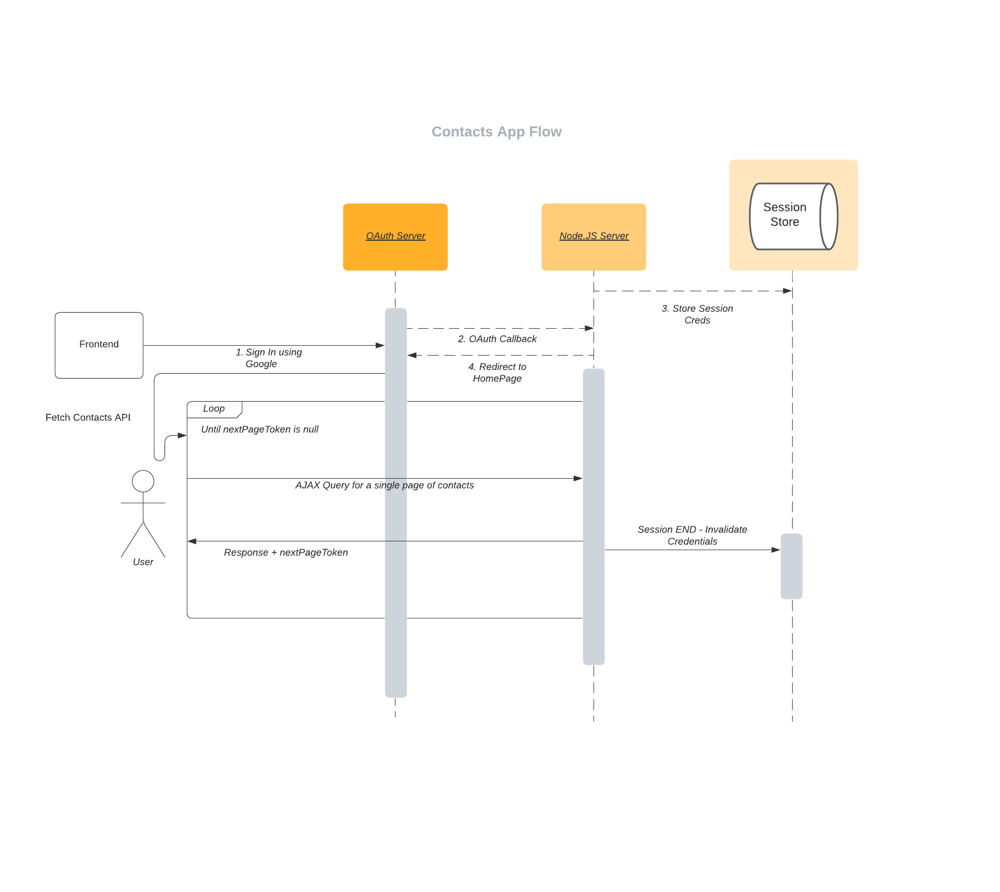

# Backend for the Google Contacts App

******************

## Methodology

The architecture of the program is as follows:

* The OAuth is done using Express.JS + Passport.JS on the server side, using a callback function on successful sign-in
* The user can also select contacts and delete them if they wish to

## Endpoints

* `GET /contacts` &#8594; Fetches a single page of contacts. Here, the pagination size is set on the server side to be a constant (10 items / page)
* `GET /contacts/all` &#8594; Fetches **all** contacts in a single API call
* `GET /contacts/total` &#8594; Fetches the total number of contacts
* `DELETE /contacts/:contactId` &#8594; Deletes a contact with the corresponding `contaectId` (`resourceName` in Google API terminology)

*******************